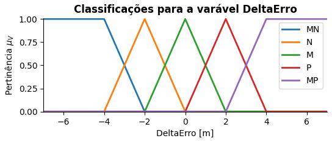
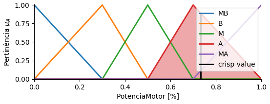
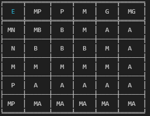
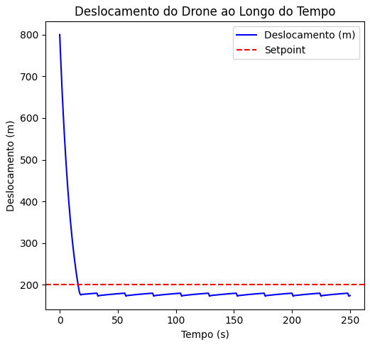

# Controle Fuzzy PD de Altitude de Drone

Este projeto implementa um sistema de controle fuzzy para ajustar a altitude de um drone em relação a um ponto de referência (`setpoint`). Utiliza lógica fuzzy para determinar a potência dos motores com base no erro atual e na variação do erro, simulando o comportamento do drone ao longo do tempo. O código também publica os dados do sistema em um tópico MQTT para monitoramento.

## Funcionalidades

- **Sistema Fuzzy:** Define variáveis fuzzy (`Erro`, `DeltaErro`, `PotenciaMotor`) e suas respectivas funções de pertinência.
- **Base de Regras:** Regras fuzzy que definem a relação entre as variáveis de entrada (`Erro`, `DeltaErro`) e a saída (`PotenciaMotor`).
- **Simulação de Altitude:** Simula o comportamento do drone ao longo do tempo com base no controle fuzzy.
- **Publicação MQTT:** Envia dados do sistema para um broker MQTT para monitoramento.

## Estrutura do Código

### 1. Definição do Sistema Fuzzy
O sistema fuzzy é configurado com as seguintes variáveis:
- **Erro:** Diferença entre a posição desejada (setpoint) e a posição atual do drone.
- **DeltaErro:** Taxa de variação do erro ao longo do tempo.
- **PotenciaMotor:** Saída que controla a potência aplicada aos motores.

Funções de pertinência são definidas para cada variável com classificações como:
- `MP` (Muito Pequeno), `P` (Pequeno), `M` (Médio), `G` (Grande), `MG` (Muito Grande).







### 2. Base de Regras
Um conjunto de regras fuzzy relaciona as entradas (`Erro`, `DeltaErro`) à saída (`PotenciaMotor`), por exemplo:
- **Regra:** SE `Erro` é `MP` E `DeltaErro` é `MP`, ENTÃO `PotenciaMotor` é `MB`.



### 3. Simulação
- **Parâmetros do Sistema:**
  - `setpoint`: Altitude desejada (em metros).
  - `posicao_atual`: Posição inicial do drone.
  - `tempo`: Tempo de simulação (em segundos).
  - `dt`: Intervalo de tempo (em segundos).
- Durante a simulação, o código calcula o erro, a variação do erro, e atualiza a posição do drone com base na saída fuzzy.

### 4. Publicação MQTT
Os dados do sistema (`setpoint`, `posicao_atual`, `potencia_motor`) são enviados para um tópico MQTT, permitindo o monitoramento remoto.

## Dependências

Certifique-se de ter as seguintes bibliotecas instaladas:

- **Lógica Fuzzy:** `scikit-fuzzy`
- **Gráficos:** `matplotlib`
- **Tabelas:** `tabulate`
- **MQTT:** `paho-mqtt`
- **Manipulação de Dados:** `numpy`, `pandas`

Instale as dependências usando:
```
pip install scikit-fuzzy matplotlib tabulate paho-mqtt numpy pandas
```

### Execução

- Configure os parâmetros iniciais, como `setpoint` e `posicao_atual`.
- Execute o código para observar os gráfico gerado:
    - Deslocamento do Drone: Mostra a posição ao longo do tempo.
- O payload é enviado para o broker MQTT especificado no código.

### Configuração MQTT

O broker e o tópico podem ser ajustados nas variáveis:
- Broker MQTT: `broker.hivemq.com` (padrão).
- Tópico: `drone/controle`.

### Interface feita no Node-red


### Exemplo de Gráfico
- Deslocamento do Drone: Mostra a posição atual comparada ao setpoint ao longo do tempo.




